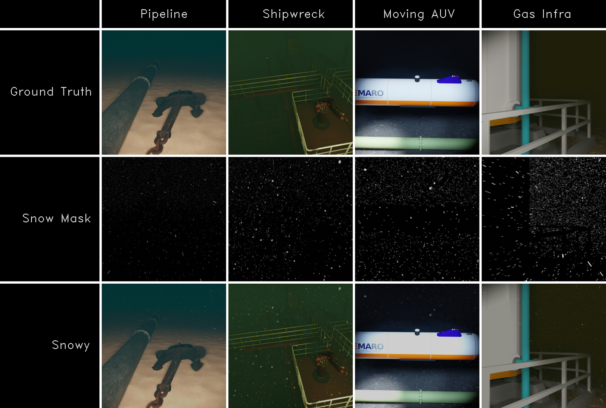

# Marine Snow Simulation and Removal in Video

Benchmark dataset for marine snow simulation and removal.

PUBLICATION:
J.P. Coffelt, N. Nowald, and P. Kampmann, "Marine Snow Simulation and Removal in Video," to appear in *Proceedings of the 2023 International Symposium on Underwater Technology (UT23)*, Tokyo, Japan.

VIDEOS:
[YouTube Playlist](https://youtube.com/playlist?list=PLCTRwTN-YZ0HReGAxDOZpk1aVTaxveM00)

ACKNOWLEDGMENT:
This project has received funding from the European Union’s Horizon 2020 research and innovation program under the Marie Skłodowska-Curie grant agreement No 956200. More info at https://remaro.eu/.

NOTES:
Full dataset available soon.